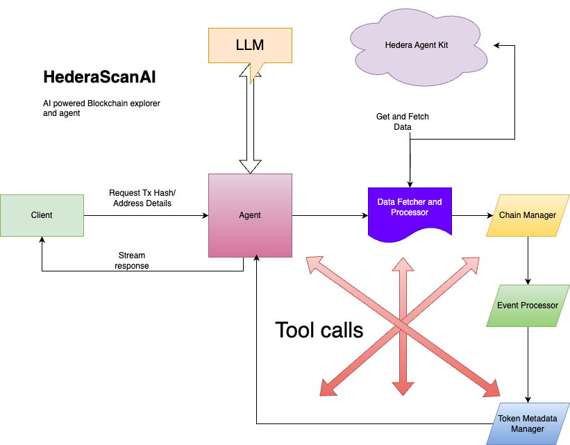

# VistiaScanAI Explorer - AI-Powered Blockchain Explorer for EduChain

### Live Link : https://vistiascanai.vercel.app/

## Overview
VistiaScanAI Explorer is an advanced AI-powered blockchain transaction analyzer designed specifically for Hedera Chain. It provides deep insights into blockchain transactions, addresses, tokens, and NFTs by leveraging AI to interpret transaction data meaningfully. VistiaScanAI enables users to understand what happens in a transaction beyond just technical details, providing an intuitive and human-like explanation.

## Key Features
- AI-Powered Transaction Analysis: Generates detailed and intuitive explanations for transaction activity, topics, Messages, etc.
- Comprehensive Transaction Breakdown: Provides insights into transfers, swaps, contract interactions, and costs.
- Security Risk Assessment: Analyzes contract verifications and potential security risks.
- Address & Token Analysis: Supports wallet address analytics and token metadata retrieval.
- Efficient Gas Cost Analysis: Evaluates gas efficiency and transaction costs.

## System Architecture
### Technical Flow Diagram
Below is the architecture diagram illustrating how vistiascanai processes transaction analysis:

## Components Breakdown
- Client: Sends transaction hash or address details for analysis.
- Agent: Central AI entity handling requests, interfacing with LLM, and returning structured responses.
- LLM (Large Language Model): Enhances analysis by interpreting blockchain data into a human-readable format.
- Data Fetcher & Processor: Fetches and processes transaction data from EduChain.
- Chain Manager: Handles interactions within the Hedera Chain blockchain.
- Event Processor: Deciphers contract calls, token movements, and smart contract interactions.
- Token Metadata Manager: Retrieves metadata for tokens and NFTs to enhance understanding.
- Tool Calls: Additional utilities for improving data interpretation.
- HederaAgentKit : For tool calls and data fetching

## Installation and Setup
Prerequisites
- Node.js (v16+ recommended)
- Yarn (Package Manager)
- Docker (Optional, for running services locally)